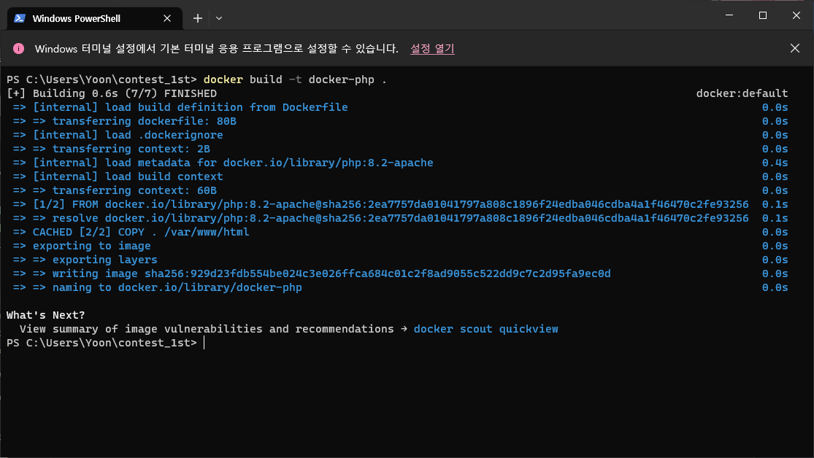
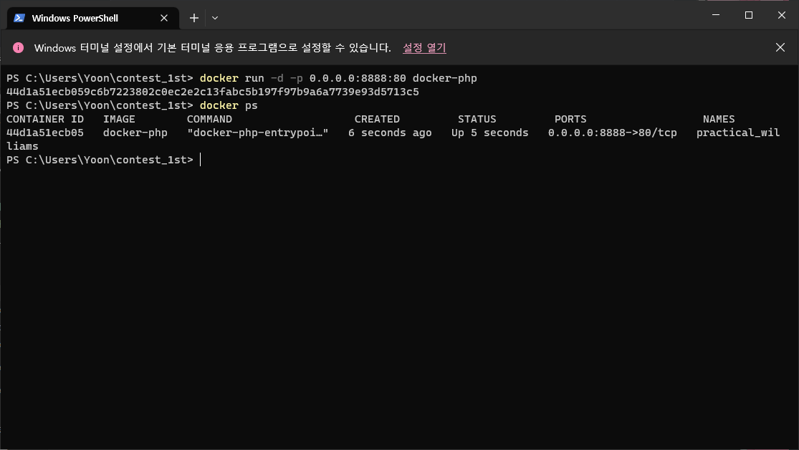
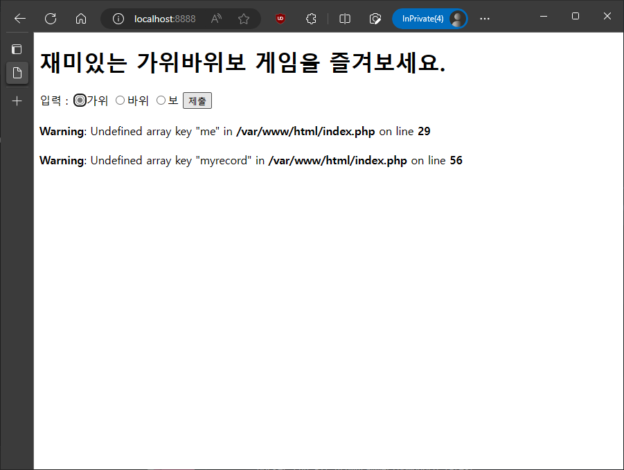
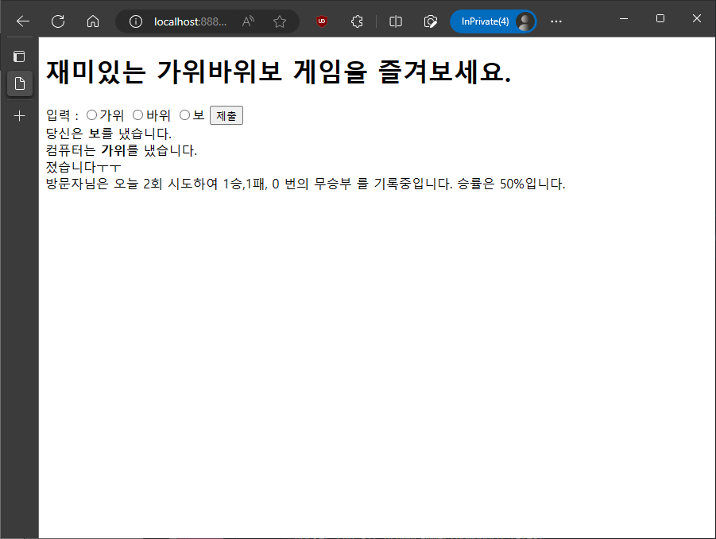

# 프로젝트 소개

## 어떤 프로그램인가요?

- 사용자와 컴퓨터 간에 가위바위보 게임을 할 수  있는 간단한 프로그램입니다.
- 쿠키 기능을 활용하여 2시간 이내의 최근 전적을 확인할 수 있습니다.

## 실행 과정

- `docker build -t docker-php .` 명령어를 통해 build


- `docker run -d -p 0.0.0.0:원하는포트번호:80 docker-php` 명령어를 통해 컨테이너 생성 및 실행




- 로컬 pc 브라우저 상에서 “localhost:설정한포트번호”으로 접속
- 가위,바위,보 중 하나를 선택하여 제출

---

## 간단 후기

- **목표하던 기능을 완성하지 못 해서 아쉬운 프로젝트**
- 처음에는 강의자료에서의 예시처럼 웹서버를 담당하는 컨테이너와 DB서버를 담당하는 컨테이너를 만들어서 컨테이너간에 연동을 시도 했지만, 웹 서버 컨테이너가 DB 서버 컨테이너와의 연결 부분에서 ‘mysqli fatal error : connection_refused’ 오류가 발생
- 문제 해결을 위해 시도해본 내용
    - 오탈자 방지
        - mysql 계정의 로그인에 필요한 패스워드를 간단한 것으로 변경해보기
        - 데이터베이스명 및 테이블명, 컬럼명을 최대한 단순한 것으로 변경
    - Docker 컨테이너 사이의 네트워킹에 대한 공부
        - docker 컨테이너를 시작할 때 사용하는 run 명령어의 파라미터 중 **—network 옵션에 값을 주지 않을 경우 기본값인 ‘bridge’ 네트워크를 사용**
        - 웹서버와 mysql 서버를 같은 네트워크로 묶기 위하여 ‘php-mysql-network’라는 네트워크를 별도 정의
            
            ```text
            docker network create php-mysql-network
            // --driver, -d 옵션을 주지 않을 경우 기본값인 bridge를 사용 
            ```
            

- DockerCompose를 사용하는 방법(별도로 예습 예정)
    - dockerCompose는 여러 컨테이너를 하나로 묶어서 서비스를 구축하고, 관리하기 쉽게 해주는 기능
    - Docker 공식문서에서는 **Compose는 멀티컨테이너 Docker 애플리케이션을 정의하고 실행하기 위한 도구입니다. Compose를 사용하면 YAML 파일을 사용하여 애플리케이션의 서비스를 구성할 수 있습니다. 그런 다음 귀하의 구성에서 단일 명령으로 모든 서비스를 만들고 시작합니다.**라고 정의되어있다. ([Docker Compose 개요 | Docker 설명서](https://docs.docker.com/compose/))
    - DockerCompose를 통해 php서버와 db서버를 구성하는 방법의 예시
    
    ```yaml
    version: '3.3'
    services:
      web:
        build:
          context: ./php
          dockerfile: Dockerfile
        container_name: php73
        depends_on:
          - db
        volumes:
          - ./php:/var/www/html/
        ports:
          - 8000:80
      db:
        container_name: mysql8
        image: mysql:8.0
        command: --default-authentication-plugin=mysql_native_password
        restart: always
        environment:
          MYSQL_ROOT_PASSWORD: myrootpassword
          MYSQL_DATABASE: mydb
          MYSQL_USER: myuser
          MYSQL_PASSWORD: mypassword
        ports:
          - 6033:3306
    ```
